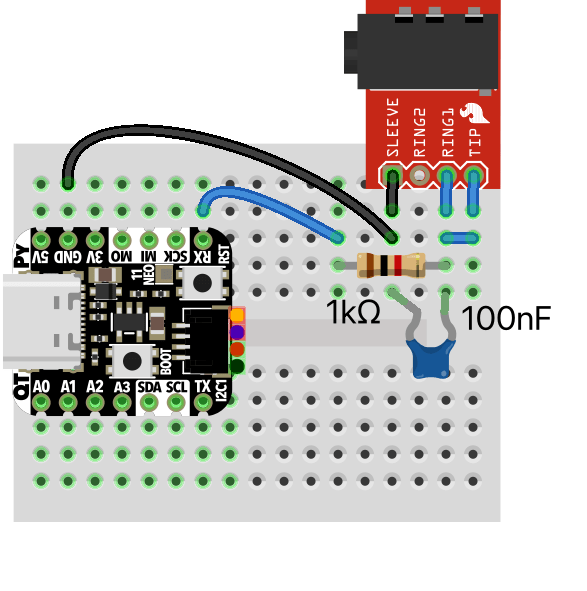
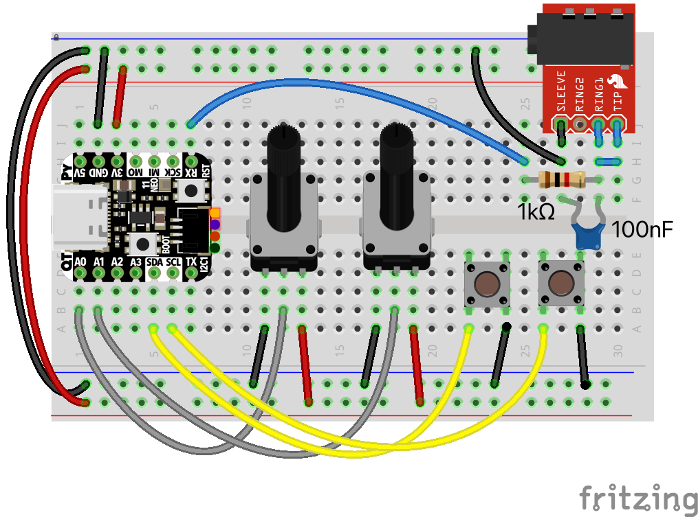
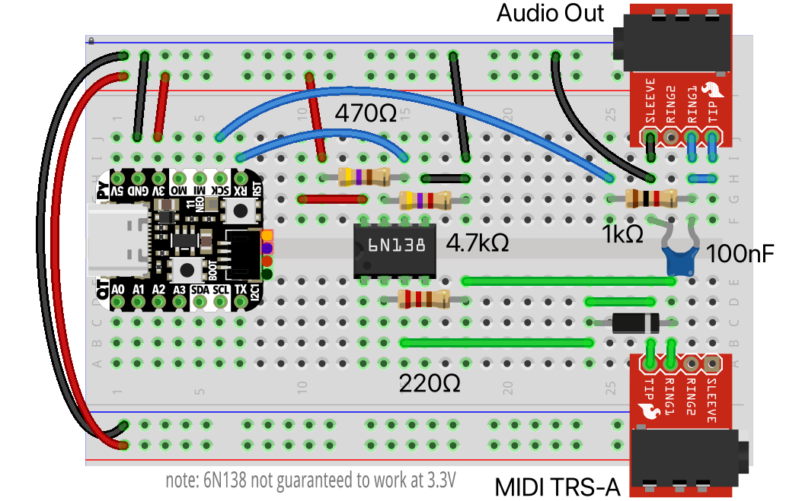

synthio-tricks examples
=======================

- [eighties_dystopia](eighties_dystopia/code.py) - A swirling ominous wub that evolves over time

  - video demo: [eighties dystopia in synthio](https://www.youtube.com/watch?v=EcDqYh-DzVA)
  - wiring diagram:

    

- [eighties_arp](eighties_arp/code.py) - An arpeggio explorer for non-musicians and test bed for my "Arpy" library

  - video demo: [eighties arp in synthio](https://www.youtube.com/watch?v=noj92Ae0IQI)
  - wiring diagram:

    

- [monosynth1](monosynth1/code.py) - A complete USB & Serial MIDI monosynth that responds to
  MIDI velocity and CCs, with adjustable filter, vibrato, release time. Great for basslines.

  - video demo: [monosynth1 in synthio](https://www.youtube.com/watch?v=S1-TDjxE3Qs)
  - wiring diagram:

    
